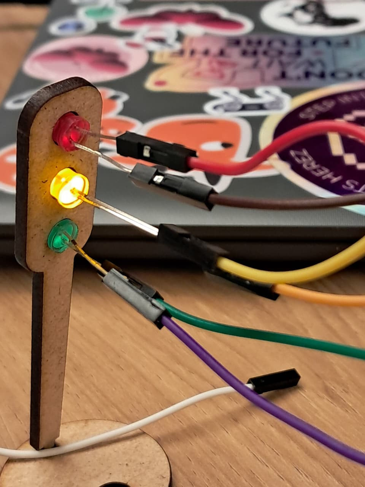

# Semáforo Offiline

&nbsp;&nbsp;&nbsp;Esta atividade se trata da construção de um semáforo offiline que comporte o seguinte caso:

<br>

"Você começou a estagiar no Departamento de Engenharia de Trânsito e ficou responsável por controlar o fluxo em uma via movimentada do bairro Butantã. Seu desafio é montar e programar um semáforo que garanta a segurança de pedestres e veículos, seguindo a lógica de tempo de cada fase das luzes, desde a montagem dos LEDs até a programação da sequência correta. Agora, você tem a chance de aplicar seus conhecimentos e desenvolver um sistema essencial para o controle do trânsito. Será que você consegue criar um semáforo que funcione perfeitamente, como aqueles que encontramos nas ruas todos os dias?"

&nbsp;&nbsp;&nbsp;A segunda questão, é que a troca de cores do semáforo deve seguir a seguinte ordem:

<br>

- 6 segundos no vermelho
- 4 segundos no verde
- 2 segundos no amarelo

<br>

### Parte 1: Montagem Física

&nbsp;&nbsp;&nbsp;Confira abaixo os itens necessários para a construção do semáforo offiline:

<br>

<p align = "center"> Quadro 1 - Componentes utilizados </p>

| Componentes                                             |
| ------------------------------------------------------- |
| 1 LED vermelho                                          |
| 1 LED verde                                             |
| 1 LED amarelo                                           |
| 3 resistores de 330Ohms                                 |
| 6 jumppers macho-fêmea                                 |
| 4 jumppers macho-macho                                  |
| 1 arduino uno                                           |
| 1 protoboard                                            |
| 1 placa mdf que simula a base no semáforo              |
| 1 placa mdf que simula o encaixe das luzes do semáforo |

<p align = "center"> Fonte produzida pela própria autora (2025) </p>

<br>

&nbsp;&nbsp;&nbsp;Antes de realizar a montagem do semáforo, é recomendado fazer a testagem e prototipagem do projeto online. Por conta disso, eu usei a plataforma Tinkercad e obtive o seguinte resultado:

<br>

<p align = "center"> Figura 1 - Planejamento no Tinkercad </p>


<p align = "center"> Fonte produzida pela propria autora (2025) </p>

<br>

&nbsp;&nbsp;&nbsp;Logo após o desenvolvimento da primeira versão do código, fiz o primeiro teste físico ainda sem montar no molde de semáfaro.
<br>

<p align = "center"> Figura 2 - Primeira versão física </p>


<p align = "center"> Fonte produzida pela propria autora (2025) </p>

&nbsp;&nbsp;&nbsp;Por fim, chegou a hora de montar nosso semáforo no molde mdf:

<br>

<p align = "center"> Figura 3 - Versão final do semáforo </p>


<p align = "center"> Fonte produzida pela propria autora (2025) </p>

<br>

<p align = "center"> Figura 4 - Semáforo no MDF </p>



<p align = "center"> Fonte produzida pela própria autora (2025) </p>

### Parte 2 - Construção do código

&nbsp;&nbsp;&nbsp;Para o funcionamento do nosso semáforo, eu me utilizei do seguinte script adicionado ao Arduino IDE:

```cpp
const int ledVermelho = 13; // porta do led vermelho
const int ledAmarelo = 12; // porta do led amarelo
const int ledVerde = 11; // porta do led verdeunsigned long intervalo = 0; // definindo o intervalo inicial entre uma cor e outraunsigned long ultimoIntervalo = 0; // variável para armazenar o último intervalo no loopint estado = 0; // 0 = vermelho, 1 = verde, 2 = amarelovoid setup()
{
  pinMode(ledVermelho, OUTPUT); // inicializando o pino do led vermelho
  pinMode(ledVerde, OUTPUT); // inicializando o pino do led verde
  pinMode(ledAmarelo, OUTPUT); // inicializando o pino do led amarelo
}void loop()
{
  unsigned long tempoAtual = millis(); // utilizando millis para capturar o tempo atual  // se o tempo atual menos o ultimo intervalo forem maiores ou iguais ao intervalo definido inicialmente, o loop continua.
  if (tempoAtual - ultimoIntervalo >= intervalo){    switch (estado){
      case 0 : // quando o semáforo está vermelho, todos os outro permanecem apagados
      digitalWrite(ledVermelho, HIGH);
      digitalWrite(ledAmarelo, LOW);
      digitalWrite(ledVerde, LOW);
      ultimoIntervalo = tempoAtual; // armazenando o tempo atual
      intervalo = 6000; // definindo por quanto tempo o semáforo vai ficar vemelho
      estado = 1; // indicando que o semáforo trocará para verde ao fim do intervalo
      break;
       case 1: // quando o semáforo está verde, todos os outros permanecem apagados
        digitalWrite(ledVerde, HIGH);
      	digitalWrite(ledAmarelo, LOW);
      	digitalWrite(ledVermelho, LOW);
        ultimoIntervalo = tempoAtual; // atualizando o tempo atual
      	intervalo = 4000; // definindo por quanto tempo o semáforo vai permanecer verde
       	estado = 2; // indicando que o semáforo trocará para verde ao fim do intervalo      break;
      case 2: // quando o semáforo está em amarelo
        digitalWrite(ledAmarelo, HIGH);
      	digitalWrite(ledVermelho, LOW);
      	digitalWrite(ledVerde, LOW);
        ultimoIntervalo = tempoAtual; // atualiza o tempo atual
      	intervalo = 2000; // definindo por quanto tempo o semáforo ficará em amarelo
      	estado = 0; // indicando que o semáforo voltará a ser vermelho ao fim do intervalo
      	break;      default:
      digitalWrite(ledVermelho, HIGH); // definindo o padrão do semáforo como vermelho
      break;
    }
  }
}
```
<br>

&nbsp;&nbsp;&nbsp;Foram utilizadas as seguintes portas:

- 13: para o LED vermelho;
- 12: para o LED verde;
- 11: para o LED amarelo;
- GND: para adicionar carga negativa; 

<br>

&nbsp;&nbsp;&nbsp; Para melhor visualização do funcionamento do semáforo você pode encontrar um link para o google drive que evidencializa a troca de cores do semáforo desenvolvido:

https://drive.google.com/file/d/1p2vMUkX4GDGMo5ovaFE4MXAb02CoW5LT/view?usp=sharing 

<br>

### Parte 3 - Avaliação em pares 

&nbsp;&nbsp;&nbsp;Este trabalho foram avaliados pelos seguintes avaliadores e seguindo o seguinte barema:

<br>

<p align = "center"> Quadro 2 - Avaliação feita pela aluna Sarah Araujo Duarte </p>

| Critério | Pontuação | Observações do Avaliador |
|----------|-----------|--------------------------|
| Montagem física com cores corretas, boa disposição dos fios e uso adequado de resistores | 3 | Nda |
| Temporização adequada conforme tempos medidos com auxílio de algum instrumento externo | 3 | Nda |
| Código implementa corretamente as fases do semáforo e estrutura do código (variáveis representativas e comentários) | 3 | Nda |
| Ir além: Implementou um componente de extra, fez com millis() ao invés do delay() e/ou usou ponteiros no código | 1 | Nda |

<p align = "center"> Fonte produzida pela própria aluna (2025) </p>

<br>

<p align = "center"> Quadro 3 - Avaliação realizada pela aluna Mariana Pereira de Souza </p>

| Critério | Pontuação | Observações do Avaliador |
|----------|-----------|--------------------------|
| Montagem física com cores corretas, boa disposição dos fios e uso adequado de resistores | 3 | Nda |
| Temporização adequada conforme tempos medidos com auxílio de algum instrumento externo | 3 | Nda |
| Código implementa corretamente as fases do semáforo e estrutura do código (variáveis representativas e comentários) | 3 | Nda |
| Ir além: Implementou um componente de extra, fez com millis() ao invés do delay() e/ou usou ponteiros no código | 1 | Nda |

<p align = "center"> Fonte produzida pela própria autora (2025) </p>